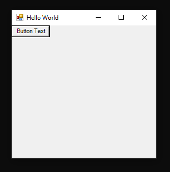

# WinForms with Python
A simple example showing the capabilities of Python (IronPython) where 
a windows form application can be created and displayed after few lines of code. 

```
# Start by importing the CLR and add the appropriate references.
import clr
clr.AddReference('System.Windows.Forms')
clr.AddReference('System.Drawing')

# Now that the references have been added import the modules.
# Just like "using System.Windows.Forms" in C# 
from System.Windows.Forms import Application, Button, Form
from System.Drawing import Point

# Create the form.
x = 0
y = 0

form = Form()
form.Text = "Hello World"

# Create a button to add to the form.
button = Button(Text="Button Text")

form.Controls.Add(button)

# Define a click event handler for the button.
def click(sender, event):
    global x, y
    button.Location = Point(x, y)
    x += 5
    y += 5

# Attach the handler.
button.Click += click

# Run the application
Application.Run(form)

```
## Final Result
After executing the source code a windows form appear as the image is showing bellow:



